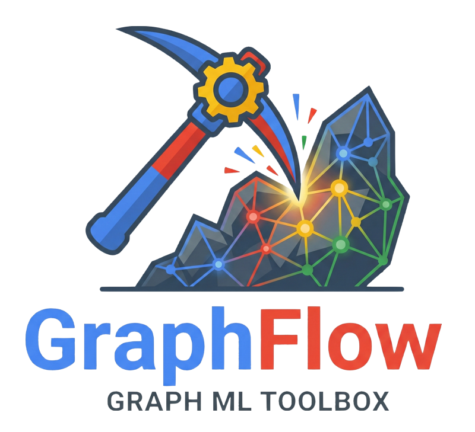

#
<div align="center">
  
</div>

**Graph Flow** (Distributed GF, or simply GF) is a Python toolkit to develop and deploy Graph Neural
Network (**GNN**) models.

DGF is developed by the Google GNN team.

!!! info
    Distributed Graph Flow is in **Pre-GA**. We are actively collaborating with
    pilot clients. Contact us if you're interested in learning more or
    participating.

## Installation

To install DGF from [PyPI](https://pypi.org/project/dgf/), run:

```shell
pip install dgf -U
```

Currently, DGF is available on Python 3.11-13, on Linux x86-64.

## 😎 Minimal Usage Example

```python
# Temporary fix for Keras dependency.
import os
os.environ["TF_USE_LEGACY_KERAS"] = "1"

# Import (distributed) graph flow
import dgf

# Fetch an example graph
graph, schema = dgf.io.fetch_ogb_graph("arxiv")

# Train a model
model = dgf.learning.train_node_model(graph=graph, schema=schema, target_column="labels")

# Look at the model
model.describe()

# Evaluate the model
model.evaluate()

# Make predictions
model.predict(graph, seed_node_idxs=[0, 1, 2])

# Save the model for later
model.save("/tmp/model")
```

(See results in the
[Getting Started tutorial](tutorial/getting_started_simple_api.ipynb))

## 🧭 Getting Started

-   **New to Graph Flow?** Follow the 🧭
    [Getting Started](tutorial/getting_started_simple_api.ipynb) tutorial to
    learn how to train a GNN model in 10 lines of code.
-   **API Reference:** The 📖 [API](api.md) page provides a comprehensive
    overview of all available functions and modules.
-   **Advanced Users:** If you are already familiar with JAX or are an advanced
    ML user, explore the 🔥
    [Getting Started: Advanced API](tutorial/getting_started_advanced_api.ipynb)
    tutorial for an introduction to DGF's low-level API.

## 🤗 Need help?

Here are several ways to get support:

*   Check the [Q&A](qna.md) for common questions and answers.
*   **Report Issues / Feature Requests:** Create a
    [GitHub Issue](https://github.com/google/distributed_graph_flow/issues).
*   **Contact the Team:**
    *   Email us at
        [distributed-graph-flow-contact@google.com](mailto:distributed-graph-flow-contact@google.com).
    *   **[Google Internal]** Join the [GNN User chat](http://go/gnn-user-chat)
        or the
        [Graph Flow team](https://moma.corp.google.com/team/1437514206756) chat.

## 🔥 Key features

High level API:

*   **Node prediction:** Train a node prediction model.

*   **Link prediction:** Train a link prediction model.

*   **Model evaluation:** Get a rich evaluation report of the model.

*   **Model export to TensorFlow:** Save the model as a TensorFlow SavedModel
    compatible with Google VertexAI.

Low level API:

*   **In-process and semi-distributed graph sampling:** Sample graphs for GNN
    training.

*   **Data Normalization:** Normalize data for consumption by neural networks.

*   **Data Sources:** Support graph formats: Parquet base-graph (Graph Flow
    format), TensorFlow GNN sample, Spanner Graph, BigQuery Graph, NetworkX.

*   **JAX GNN layers:** Heterogeneous Message Passing GNN, Heterogeneous Graph
    Attention Network, Homogenizer.
