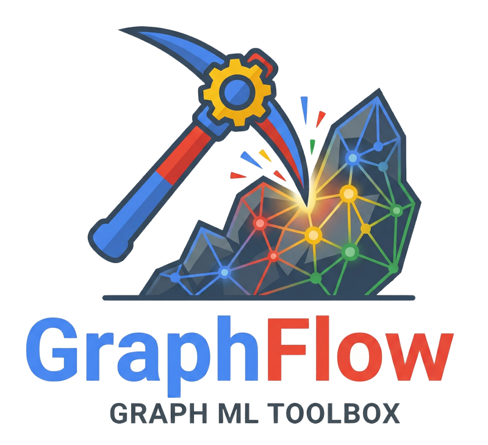

#

<div align="center">
  
</div>

**(Distributed) Graph Flow** (GF) is a powerful Python toolkit to simplify the
development and deployment of Graph Neural Network (**GNN**) models.

GF is developed by the Google's GNN team.

<div style="border: 1px solid #a8a8a8; padding: 10px; border-radius: 5px; background-color: #f5f5f5;">
Information:
<ul>
  <li>Graph Flow (GF) is currently in **Pre-GA**. We are actively collaborating with pilot clients. Please contact us if you're interested in learning more or participating.</li>
  <li>This is the **alpha public GF documentation**. For the Google internal version, visit <a href="http://go/graph-flow">go/graph-flow</a>.</li>
</ul>
</div>

## 😎 Minimal Usage example

```python
# Temporary fix for Keras dependency.
import os
os.environ["TF_USE_LEGACY_KERAS"] = "1"

# Import (distributed) graph flow
import dgf

# Fetch an example graph
graph, schema = dgf.io.fetch_ogb_graph("arxiv")

# Train a model
model = dgf.learning.train_node_model(graph=graph, schema=schema, target_column="labels")

# Look at the model
model.describe()

# Evaluate the model
model.evaluate()

# Make predictions
model.predict(graph, seed_node_idxs=[0, 1, 2])

# Save the model for later
model.save("/tmp/model")
```

(see results in the
[Getting Started tutorial](tutorial/getting_started_simple_api.ipynb))

## 🧭 Getting Started

-   **New to Graph Flow?** Follow the 🧭
    [Getting Started](tutorial/getting_started_simple_api.ipynb) tutorial to learn how
    to train a GNN model in 10 lines of code.
-   **API Reference:** The 🐜 [API](api.md) page provides a comprehensive
    overview of all available functions and modules.
-   **Advanced Users:** If you are already familiar with JAX or are an advanced
    ML user, explore the 🔥
    [Getting Started for Advanced API](tutorial/getting_started_advanced_api.ipynb)
    tutorial for an introduction to GF's low-level API.

## 🔥 Key features

Key goals and features include:

*   **Data Normalization:** An efficient set of well-documented python-native
    graph formats.

*   **Data Sources:** A robust suite of I/O tools to support internal and
    external data sources that are well documented, easy to use, and prepare
    data in supported Graph Flow formats.

*   **Pythonic:** Python first to maximize contributions from partners, dropping
    to native code when warranted for performance.

*   **Scalability:** Support for running distributed graph processing algorithms
    with [Apache Beam](https://beam.apache.org/) on
    [Google Cloud Dataflow](https://cloud.google.com/dataflow/docs/overview)

*   **Fast experimentation:** Intuitive suite of graph processing tools that can
    be used in any environment (local, internal/external colab, x-borg, xcloud,
    etc ) for fast experimentation or production.

*   **Ease of Use:** Provide a high level API for common tasks.

*   **Modular:** A tool-box-first approach to Graph Mining. The internal parts
    of the high-level API should be accessible to clients to encourage re-use
    and high velocity development. If you like something in Graph Flow, use it,
    ignore the bits you don't.

*   **Interoperability:** Provide clear paths for migrating experimental
    in-memory routines to distributed frameworks. Running pipelines on
    [Google Cloud Dataflow](https://cloud.google.com/dataflow/docs/overview)
    should only involve updating dependencies.

*   **Integration:** Works with standard Google internal and external
    infrastructure prioritizing feeding JAX models.

*   **Ease of Development:** Internal Google researchers should be able to
    deploy a model to GCP production immediately, with no code changes.

*   **Open Source:** Non-confidential parts of Graph Flow can be open sourced to
    engage the broader Graph Mining community and our internal research
    objectives. Confidential technologies can remain closed sourced and used
    internally.

*   **VertexAI pipeline integration:** Expose common graph learning tools as
    [VertexAI pipeline components](https://cloud.google.com/vertex-ai/docs/pipelines/build-own-components)
    that can be used to define and orchestrate Graph Processing systems in
    Google Cloud.

*   **Build Bridges:** Accelerate bringing Graph Mining research to production
    internally and externally. Provide a common substrate for Cloud Engineers
    and Internal SWEs to build products together backed by Graph Mining.
