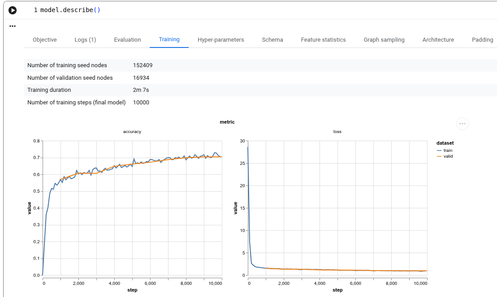
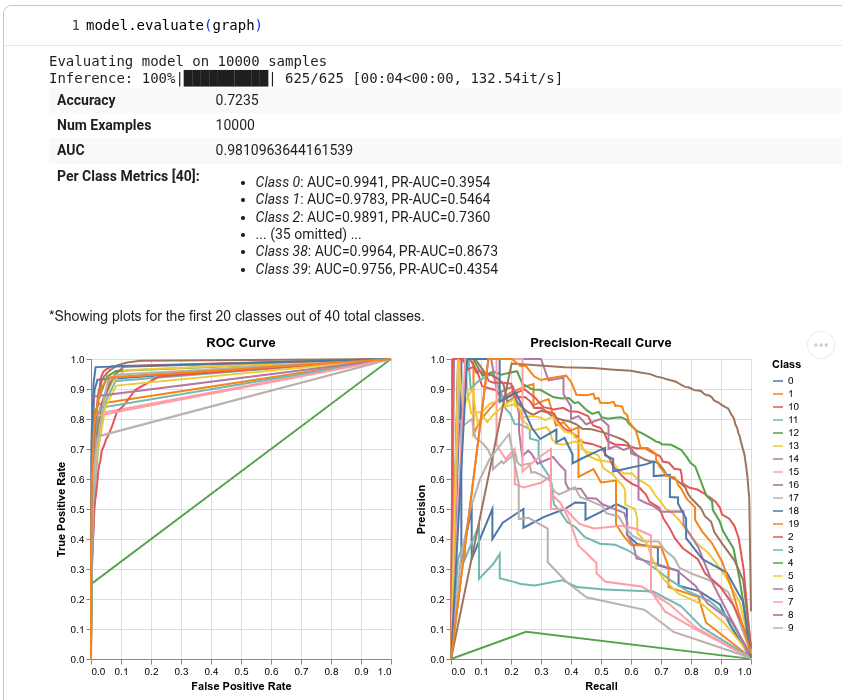

#

**Graph Flow** (DGF) is an open-source Python library to train, evaluate, and
deploy Graph Neural Networks (GNNs). It is developed by the Google GNN team, the
team behind [TensorFlow GNN](https://github.com/tensorflow/gnn), and is its
successor.

Graph Flow has two APIs:

-   The **Simple API** is as easy to use as scikit-learn: one function call
    trains a GNN model from a graph and a target column, and the resulting
    model can be evaluated, used for predictions, and saved. Graph sampling,
    feature normalization, and model architecture are configured
    automatically.
-   The **Advanced API** is a set of composable building blocks (graph IO,
    samplers, feature normalizers, and JAX/Flax GNN layers). You pick the ones
    you need and assemble them with your own code, including
    PyTorch Geometric models.

## 🔥 Why Graph Flow?

-   **Simple API:** Train, evaluate, and save a GNN model in about 10 lines of
    Python, without prior GNN experience.
-   **Temporal graphs:** Dynamic graphs and time-series features are supported.
    Time-aware sampling ensures that a model only sees information available
    before the prediction time.
-   **Scale:** Train in memory on graphs with up to 1B edges on a single
    machine. For larger graphs, the distributed training scales to trillions of
    edges.
-   **Advanced API:** Message-passing layers (MPNN, GAT, Graph Transformer),
    samplers, and normalizers are independent JAX/Flax building blocks for
    custom models.
-   **Interoperability:** Convert graphs to PyTorch Geometric, TensorFlow,
    TF-GNN, and NetworkX. For example, use Graph Flow to load and sample a
    graph, and PyG to train the model
    ([example](https://github.com/google/distributed_graph_flow/blob/main/examples/node_classification_pyg.py)).
-   **Data sources:** Read graphs from Parquet files, TF-GNN graph samples,
    Spanner Graph, BigQuery Graph, and NetworkX.
-   **Deployment:** Run inference in-process in Python, or export models to
    TensorFlow SavedModel (e.g., for Vertex AI).

## 🎯 Is Graph Flow right for your problem?

GNNs are a good fit when your data consists of interconnected entities, for
example multiple tables linked by keys, transactions between accounts, or
time-series events. Tabular models (e.g., gradient boosted trees) ignore these
relations, and LLMs are costly to run on large structured datasets. Typical
tasks are:

-   **Node classification:** Spam, fraud, and abuse detection; bot
    classification; account takeover.
-   **Node regression:** Hardware failure prediction, latency forecasting,
    customer churn.
-   **Link prediction:** Recommendation, citation prediction.
-   **Node and graph embeddings** *(coming soon)*: Representation learning for
    search ranking, clustering, and LLM input.

## 😎 Simple usage example

Install Graph Flow from [PyPI](https://pypi.org/project/dgf/) (Python 3.11–3.13,
Linux x86-64):

```shell
pip install dgf -U
```

Then, train a complete node classification GNN model on the
[OGB arXiv](https://ogb.stanford.edu/docs/nodeprop/#ogbn-arxiv) citation graph
in 10 lines of Python (click on **Output** to expand the results):

```python
import dgf

# Download an example graph
graph, schema = dgf.io.fetch_ogb_graph("arxiv")

# Train a GNN model to predict the "labels" feature on the "nodes" nodeset
model = dgf.learning.train_node_model(
    graph=graph,
    schema=schema,
    target_column="labels",
    target_nodeset="nodes",
)
```

??? example "Output"

    ```text
    Preparing dataset
    Num. training seed nodes: 152409, Num. validation seed nodes: 16934
    Preparing dataset finished in 3.52 seconds
    Caching validation dataset finished in 5.67 seconds
    Number of cache validation batches: 529
    Training model
    Generate first batch to initialize model
    Create model variables
    ...Tracing model
    Create model variables finished in 7.42 seconds
    Will validate model every 1000 step(s)
    Will checkpoint model every 1000 step(s)
    Start training. The first two steps are generally slow.
    Training:  10%|▉         | 992/10000 [00:18<01:25, 105.02it/s, step=1000, train-accuracy=0.5697, train-loss=1.5092]
    Training: 100%|██████████| 10000/10000 [01:49<00:00, 91.32it/s, step=9900, train-accuracy=0.7050, train-loss=0.9234, valid-accuracy=0.7032, valid-loss=0.9513]
    Restoring best model parameters with validation loss 0.945846 from step 10000
    Final metrics: {'step': '9900', 'train-accuracy': '0.7050', 'train-loss': '0.9234', 'valid-accuracy': '0.7032', 'valid-loss': '0.9513'}
    Training model finished in 117.85 seconds
    Final model evaluation
    Evaluating model on generator
    Evaluation: 100%|██████████| 10000/10000 [00:06<00:00, 1463.66it/s]
    ```

```python
# Inspect training statistics, architecture, and schema
model.describe()
```

??? example "Output"

    

```python
# Evaluate quality metrics
model.evaluate()
```

??? example "Output"

    

```python
# Make low-latency predictions in-process
model.predict(graph, seed_node_idxs=[0, 1, 2])
```

??? example "Output"

    ```text
    array([[7.54999419e-05, 3.81319027e-04, 1.72524105e-05, 1.92803110e-03,
            8.16370904e-01, 2.45856913e-03, 1.42833189e-04, 3.89835302e-04,
            1.02235435e-03, 1.59653846e-05, 1.05817253e-02, 1.66349622e-04,
            2.24696038e-07, 5.67139999e-04, 1.16685828e-06, 1.30570133e-05,
            1.84653066e-02, 1.01524356e-05, 1.19269625e-05, 4.92823659e-04,
            5.76051571e-06, 3.18754552e-04, 1.57974500e-05, 1.38371877e-04,
            1.40396342e-01, 2.21383398e-05, 6.77731412e-04, 5.43191454e-05,
            2.81101861e-03, 1.29758300e-05, 1.40280827e-04, 7.64641154e-05,
            1.21267367e-05, 1.56967496e-06, 4.33137146e-04, 4.30545424e-06,
            1.53830438e-03, 2.04537064e-04, 7.27951203e-07, 2.27046985e-05]],
          dtype=float32)
    ```

```python
# Save the model (architecture, weights, etc.)
model.save("/tmp/model")
```

Check the [Getting Started tutorial](tutorial/getting_started_simple_api.ipynb)
for the complete, interactive walkthrough.

## 🧩 Advanced API: composable building blocks

The Simple API is assembled from the building blocks of the Advanced API, and
you can use them directly. Each block does one thing (load,
sample, normalize, or run message passing), and blocks can be combined with
each other or with other frameworks. For example, you can use Graph Flow to
load, sample, and normalize a graph, and train a PyTorch Geometric or JAX/Flax
model on the result:

=== "PyTorch Geometric"

    ```python
    import dgf

    graph, schema = dgf.io.fetch_ogb_graph("mag")

    # Graph Flow: Sample 2-hop neighborhoods around the seed nodes
    sampler = dgf.sampling.create_sampler(
        graph=graph,
        schema=schema,
        plan=dgf.sampling.SimpleSamplingConfig(
            seed_nodeset="paper", num_hops=2, hop_width=10, reverse=True
        ),
        batch_size=256,
    )
    merger = dgf.transform.GraphMerger(schema=schema, padding=None, sentinel_offset=False)
    batch, offsets = merger(sampler.sample(seed_node_idxs))

    # Graph Flow: Normalize the features automatically
    normalizer = dgf.transform.auto_normalize(schema=schema, stats=feature_stats)
    batch = normalizer.normalize_numpy(batch)

    # PyG: Convert to HeteroData, and train any PyG model
    data = dgf.convert.graph_to_pyg_data(batch, normalizer.output_schema())
    logits = pyg_model(data.x_dict, data.edge_index_dict, offsets["paper"])
    ```

    See the complete
    [PyG example](https://github.com/google/distributed_graph_flow/blob/main/examples/node_classification_pyg.py).

=== "JAX / Flax"

    ```python
    import dgf
    import flax.linen as nn

    class Model(nn.Module):
      schema: dgf.data.GraphSchema
      num_classes: int

      @nn.compact
      def __call__(self, graph, seed_node_idxs, training):
        # Embed the raw features of each nodeset
        embedder = dgf.jax.layers.EmbedGraphConfig()
        graph = embedder.make(schema=self.schema)(graph, training=training)
        hidden_schema = embedder.output_schema(self.schema)

        # Heterogeneous message passing
        for _ in range(2):
          conv = dgf.jax.layers.HeterogeneousGraphConvolutionConfig(dims=128)
          graph = conv.make(hidden_schema)(graph, training=training)

        # Classify the seed nodes
        embeddings = graph.node_sets["nodes"].features["embedding"][seed_node_idxs]
        return nn.Dense(self.num_classes)(embeddings)
    ```

    See the [Advanced API tutorial](tutorial/getting_started_advanced_api.ipynb)
    for the complete training loop.

## 🧭 Getting started & resources

-   **Getting Started:** The
    [Getting Started tutorial](tutorial/getting_started_simple_api.ipynb)
    trains a first GNN model with the Simple API.
-   **Advanced API:** The
    [Advanced API tutorial](tutorial/getting_started_advanced_api.ipynb) builds
    a custom GNN from the JAX/Flax building blocks.
-   **Distributed sampling:** The
    [Offline Distributed Sampler tutorial](tutorial/gcp_offline_distributed_sampler.ipynb)
    samples large graphs on Google Cloud Dataflow.
-   **API reference:** The [API documentation](api.md) lists all modules and
    functions.
-   **Examples:** End-to-end
    [example scripts](https://github.com/google/distributed_graph_flow/tree/main/examples),
    including training a PyG model.
-   **Q&A:** The [Q&A](qna.md) covers the relation to TF-GNN, supported
    formats, and large graphs.

## 🤗 Community & support

-   **Bugs and feature requests:** Open a
    [GitHub issue](https://github.com/google/distributed_graph_flow/issues).
-   **Contact:** Email the team at
    [distributed-graph-flow-contact@google.com](mailto:distributed-graph-flow-contact@google.com).
-   **Release notes:** See the [Changelog](changelog.md).
-   **Googlers:** See [go/graph-flow](http://go/graph-flow) for the internal
    documentation.

<small>This is not an officially supported Google product.</small>
